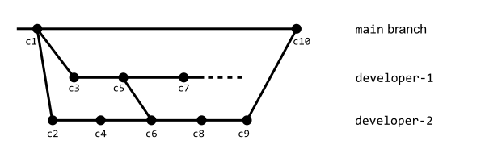

# PJP PAC 1

En aquesta PAC aprendrem a gestionar GitHub i el seu entorn de programació estandard que utilitzarem a la resta de PACs de l'assignatura.

## Competències

En aquesta PAC es desenvolupen les següents competències del Màster:

- [CB10] Que els estudiants posseeixin les habilitats d'aprenentatge que els permetin continuar estudiant d'una manera que haurà de ser en gran manera autodirigida o autònoma.
- [CG1] Analitzar i sintetitzar informació tècnica complexa.
- [CE3] Utilitzar de manera adequada els llenguatges de programació i les millors eines de desenvolupament per a l'anàlisi, el disseny i la implementació de llocs i aplicacions web en funció de les necessitats del projecte.
- [CE8] Adaptar-se a les tecnologies web i als futurs entorns actualitzant les competències professionals.

## Objectius

Els objectius d'aquesta PAC són:

- Configurar un entorn de treball per desenvolupar aplicacions en JavaScript.
- Conèixer i saber utilitzar les ordres bàsiques de Git.
- Conéixer i saber utilitzar GitHub i les principals tasques col·laboratives de la plataforma.
- Revisar el nivell previ de programació.
- Posar en pràctica coneixements bàsics de JavaScript.

## Entrega de la PAC

Un cop hagis realitzat les activitats pràctiques proposades en aquest enunciat, **el lliurament es realitzarà de forma doble**:

- Hauràs d'enviar els teus canvis a l'apartat de l'aula virtual de la UOC.
- Hauràs d'enviar els teus canvis al Repositori de GitHub Classroom.

Recorda que aquest repositori l'has clonat del repositori a GitHub. Quan treballis al teu sistema, tots els canvis els faràs als teus fitxers locals, els quals hauràs d'afegir i _comitejar_ al teu repositori Git. Aquests canvis estaran al teu sistema fins que facis _push_ i els enviïs al repositori a GitHub.

Recorda que has de treballar a la branca _main_ o _master_ (la que es crei per defecte). Pots fer diversos enviaments.

A l'aula virtual trobaras una _checklist_ que t'ajudarà a repassar tots els passos que has de fer per al lliurament de la teva PAC.

## Puntuació

El fet de treballar amb tests per verificar la funcionalitat del codi, us permetrà tenir una idea de la vostra pròpia nota abans del lliurament.

La puntuació dels exercicis pràctics es basa en dos criteris: **Funcionalitat** i **implementació**. S'espera que els exercicis funcionin correctament (superin els tests) i que la implementació (el codi) tingui una qualitat adequada.

Alguns detalls a tenir en compte:

- Es penalitzarà qualsevol intent de _hardcodejar_ els tests per forçar que passin. Aquesta tècnica consisteix a canviar la implementació perquè retorni únicament el valor esperat pel test (qualsevol altre test fallaria).
- Els tests automàtics estan dissenyats per detectar exercicis erronis o incomplets. El fet que un test passi no garanteix que l'exercici estigui realitzat correctament.
- Un exercici els tests del qual no passen es puntuarà amb un 0 llevat que hi hagi problemes amb el test.
- A més de passar els tests, el professorat avaluarà el vostre codi en base als criteris següents:
  - Llegibilitat, senzillesa i qualitat del codi.
  - Coneixements de programació. Per exemple, no utilitzar les estructures de control adequades, com ara utilitzar un bucle per construir una sentència condicional o viceversa.

## Requeriments mínims

- Tenir instal·lat Visual Studio Code.
- Coneixements bàsics de Git i GitHub (Activitats 2 i 3 del Repte 1).
- Coneixements bàsics de programació (Requisit de l'assignatura).

## Activitats del repte (1p)

Recorda que aquest repte té associades dues activitats d'avaluació que també hauràs de realitzar. En particular, són les activitats 2.4 i 3.2, que trobaràs a l'aula virtual.

## Preguntes Teòriques (7p)

Hauràs de respondre aquestes preguntes al fitxer `src/pec1/pec1.md`

### Exercici T1 (2p)

La següent imatge mostra un escenari de desenvolupament col·laboratiu en GitHub:


A la part superior central pots veure el repositori en GitHub, el qual conté els fitxers indicats a la caixa. A la part inferior, s'han representat tres desenvolupadors, denominats `Dev1`, `Dev2` i `Dev3`, respectivament. Cada desenvolupador ha clonat el repositori de GitHub i ha editat el fitxer indicat en negreta.

Respon les següents preguntes i raona la resposta (màxim 300 paraules):
* T1.1 (1p) Indica les comandes que hauria de realitzar cada desenvolupador per a sincronitzar els seus canvis amb el repositori en GitHub. 
* T1.2 (1p) Pot donar-se alguna situació de conflicte en aquest escenari? En cas afirmatiu, explica quina seria.

### Exercici T2 (3p)

La següent figura mostra un escenari de l'evolució d'un repositori on treballa un equip de desenvolupament:



Cadascuna de les línies horitzontals representa una branca en el repositori. Com pots veure, existeixen tres branques:

* `main`, que és la branca principal del repositori.
* `developer-1`, que és la branca on treballa un dels desenvolupadors. Aquesta branca encara està en desenvolupament, per això s'indica amb una línia puntejada.
* `developer-2`, que és la branca on ha treballat un dels desenvolupadors per resoldre un problema detectat a l'aplicació. Aquesta branca ja no està en desenvolupament.

Cada cercle representa un commit en el repositori. Els commits s'han numerat segons el seu moment temporal de creació. A més, la seva posició horitzontal en cadascuna de les branques també ajuda a visualitzar el moment temporal en el qual s'han creat. D'aquesta manera, el commit `c6` s'ha creat abans que el commit `c8`, i el cercle que representa `c6` està més a l'esquerra que el cercle que representa `c8`.

Respon la següent pregunta i raona la resposta (màxim 300 paraules):
* T2.1 (1p) Quins commits són considerats a la rama `developer-2`? 
* T2.2 (2p) Tenint en compte que la branca `developer-2` va ser integrada en la branca `main` perquè corregia un problema detectat a l'aplicació, què ha de fer el desenvolupador que continua treballant en la branca `developer-1`?

### Exercici T3 (2p)

En aquest exercici practicaras el desenvolupament basat en _pull requests_ creant tu mateix un _pull request_ a un repositori de GitHub.

Hauràs d'enviar un _pull request_ al repositori [`https://github.com/PJP-UOC/20232-pec-1-T3`](https://github.com/PJP-UOC/20232-pec-1-T3), que haurà d'incloure un canvi a l'únic fitxer que es troba al repositori, és a dir, el fitxer `README.md`. En particular, hauràs d'afegir una línia al final del fitxer `README.md` amb el teu nom, nom d'usuari de GitHub i la teva aula (p. ex., `Pere, psoltus, 1`).

* T3.1 (2p) Envia un _pull request_ tal com s'indica a l'enunciat. En la teva resposta hauràs de descriure els passos que has fet, adjuntant captures de pantalla que mostrin el procés i, finalment, l'enllaç al _pull request_ que has creat.

> Compte: El _pull request_ haurà d'incloure canvis només a l'únic fitxer que es troba al repositori, és a dir, el fitxer `README.md`.

## Exercicis pràctics (2p)

Per realitzar els exercicis pràctics t'has de dirigir al fitxer `src/pec1/pec1.js`.

En aquest fitxer hauràs de definir les funcions que t'indiquem als exercicis que veuràs més avall.

D'altra banda, els tests que et permetran saber si la solució que proposes per als exercicis és correcta són al fitxer `src/pec/pec1.spec.js`.
**No has d'editar aquest fitxer (ni cap altre que no se t'indiqui expressament)**.
Tingues en compte que els tests són condicions que han de complir les funcions que implementaràs en els exercicis, per la qual cosa et poden servir d'ajuda per corregir-los.

### Preparant l'entorn. (0p)

En primer lloc, assegura't que tens instal·lats:

- [Node.js](https://nodejs.org/es/)
- [VSCode](https://code.visualstudio.com/)
- [Git](https://git-scm.com/)

Perquè el vostre professor us localitzi a GitHub Classroom, recorda que necessita conèixer el vostre _login_ a la plataforma. Un cop estigueu registrats a GitHub, podeu informar del vostre _login_ tal com es descriu a l'activitat 4.2 del Repte 1.

A continuació us donem algunes indicacions per preparar el vostre repositori per a la realització dels exercicis.

#### Instal·la les dependències del projecte

````
npm install
````

Recorda que cal estar situat a la carpeta arrel del projecte.

#### Executa els tests

````
npm t
````

La instrucció anterior llançarà els tests cada vegada que deseu el fitxer `src/pec1/pec1.js`, que és precisament on implementareu els exercicis d'aquesta PAC.

Com pots esperar, la primera vegada que executis `npm t` i es llencin els tests, fallaran tots, ja que no hi ha cap exercici implementat. Revisa el missatge d'error que s'imprimeix per pantalla per conèixer el format i entendre com es notifiquen els errors.

Aquest és un exemple d'una possible sortida d'error:

````
  FAIL src/pec1/pec1.spec.js
   ex1:
     × should return true when value is between 0 and 17 (2 ms)
````

És important fixar-se en la descripció de l'error, per exemple, el text d'error anterior indica que per a l'exercici 1 (`ex1`) la funció ha de tornar `true` si `temp` és més gran o igual que 37.0. Aquesta indicació us ajuda a revisar el codi per comprovar perquè el comportament no és l'esperat.

Un cop corregit el problema, quan es desa el fitxer on estem editant els exercicis, el test es torna a llançar i ens mostraria:

````
  PASS src/pec1/pec1.spec.js
   ex1
     √ should return true when value is between 0 and 17 (2 ms)
````

Ara el test mostra `PASS` i el cas de prova que abans fallava es mostra com a correcte (amb el caràcter `√`).

L'entorn de proves té un menú (accessible mitjançant la tecla `w`) que us permet executar els tests selectivament. Per exemple, prement `a` podeu rellançar manualment tots els tests; i prement `f` podeu rellançar només aquells tests que han fallat. Proveu les diferents opcions i si teniu algun dubte, consulteu-lo al fòrum de l'assignatura.

### Exercici P1 (1p)

Implementa una funció `ex1` que determini si un determinat valor numèric, que representa l'edat d'una persona, es troba dins de l'interval [0, 17].

La funció rebrà el següent paràmetre:
* `value`: És un valor numèric.

La funció retornarà `true` si el valor es troba entre els valors 0 i 17, ambdós inclosos. En cas contrari, la funció retornarà `false`.

### Exercici P2 (1p)

Implementa una funció `ex2` que apliqui el valor de l'IVA al preu de venta d'un producte.

La funció rebrà els següents paràmetres:
* `price`: El preu de venda d'una unitat de producte. És un valor numèric positiu que pot portar decimals.
* `tax`: És el valor de l'IVA a aplicar. És un valor numèric positiu que representa el percentatge d'IVA a aplicar (p. ex. 21)

La funció haurà de retornar el preu del producte amb l'IVA aplicat.