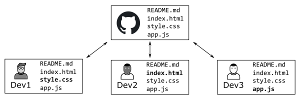
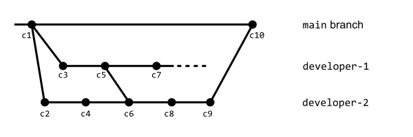

# PJP PEC 1

En esta PEC vamos a aprender a manejar GitHub y el entorno de programación que utilizaremos en el resto de PECs de la asignatura.

## Competencias

En esta PEC se desarrollan las siguientes competencias del Máster:

- [CB10] Que los estudiantes posean las habilidades de aprendizaje que les permitan continuar estudiando de una manera que tendrá que ser en gran medida autodirigida o autónoma.
- [CG1] Analizar y sintetizar información técnica compleja.
- [CE3] Utilizar de manera adecuada los lenguajes de programación y las mejores herramientas de desarrollo para el análisis, el diseño y la implementación de lugares y aplicaciones web en función de las necesidades del proyecto.
- [CE8] Adaptarse a las tecnologías web y a los futuros entornos actualizando las competencias profesionales.

## Objetivos

Los objetivos de esta PEC son:

- Configurar un entorno de trabajo para el desarrollo de aplicaciones en JavaScript.
- Conocer y saber utilizar los comandos básicos de Git.
- Conocer y saber utilizar GitHub y las principales tareas colaborativas de la plataforma.
- Revisar el nivel previo de programación.
- Poner en práctica conocimientos básicos de JavaScript.

## Entrega de la PEC

Una vez hayas realizado las actividades prácticas propuestas en este enunciado, **la entrega se realizará de forma doble**:

- Deberás enviar tus cambios al apartado del aula virtual de la UOC.
- Deberás enviar tus cambios al repositorio de GitHub Classroom.

Recuerda que este repositorio lo has clonado del repositorio en GitHub. Cuando trabajes en tu sistema, todos los cambios los harás en tus ficheros locales, los cuales tendrás que añadir y _comitear_ a tu repositorio Git. Estos cambios estarán en tu sistema hasta que hagas _push_ y los envíes al repositorio en GitHub.

Recuerda que debes trabajar en la rama _main_ o _master_ (la que se cree por defecto). Puedes hacer varios envíos.

En el aula virtual encontrarás una _checklist_ que te ayudará a repasar todos los pasos que debes hacer para la entrega de tu PEC.

## Puntuación

El hecho de trabajar con tests para verificar la funcionalidad del código os permitirá tener una idea de vuestra propia nota antes de la entrega. 

La puntuación de los ejercicios prácticos se basa en dos criterios: **Funcionalidad** e **implementación**. Se espera que los ejercicios funcionen correctamente (pasen los tests) y que la implementación (el código) tenga una calidad adecuada. 

Algunos detalles a tener en cuenta:

- Se penalizará cualquier intento de _hardcodear_ los tests para forzar que pasen. Esta técnica consiste en cambiar la implementación para que devuelva únicamente el valor esperado por el test (cualquier otro test fallaría).
- Los tests automáticos están diseñados para detectar ejercicios erróneos o incompletos para casos concretos. El hecho de que un test pase no garantiza que el ejercicio esté realizado correctamente, es decir, que cubra todos los casos.
- Un ejercicio cuyos tests no pasan se puntuará con un 0 salvo que existan problemas con el test.
- Además de pasar los tests, el profesorado evaluará vuestro código en base a los siguientes criterios:
  - Legibilidad, sencillez y calidad del código.
  - Conocimientos de programación. Por ejemplo, no utilizar las estructuras de control adecuadas, como utilizar un bucle para construir una sentencia condicional o viceversa.

## Requisitos mínimos

- Tener instalado Visual Studio Code.
- Conocimientos básicos de Git y GitHub (Actividades 2 y 3 del Reto 1).
- Conocimientos básicos de programación (Requisito de la asignatura).

## Actividades del reto (1p)

Recuerda que este reto tiene asociadas dos actividades de evaluación que también deberás realizar. En particular, son las actividades 2.4 y 3.2, que encontrarás en el aula virtual. 

## Preguntas Teóricas (7p)

Deberás responder a estas preguntas en el fichero `src/pec1/pec1.md`

### Ejercicio T1 (2p)

La siguiente imagen muestra un escenario de desarrollo colaborativo en GitHub:



En la parte superior central puedes ver el repositorio en GitHub, el cual contiene los ficheros indicados en la caja. En la parte inferior, se han representado tres desarrolladores, denominados `Dev1`. `Dev2` y `Dev3`, respectivamente. Cada desarrollador ha clonado el repositorio de GitHub y ha editado el fichero indicado en negrita. 

Responde y razona las siguientes preguntas (máximo 300 palabras):
* T1.1 (1p) Indica los comandos que debería realizar cada desarrollador para sincronizar sus cambios con el repositorio en GitHub. 
* T1.2 (1p) ¿Puede darse alguna situación de conflicto en este escenario? Si es así, descríbela.

### Ejercicio T2 (3p)

La siguiente figura muestra un escenario de la evolución de un repositorio donde trabaja un equipo de desarrollo:



Cada una de las líneas horizontales representa una rama en el repositorio. Como puede observarse, existen tres ramas:

* `main`, que es la rama principal del repositorio.
* `developer-1`, donde está trabajando uno de los desarrolladores de la aplicación. Esta rama todavía está en desarrollo, por eso se indica con una línea discontinua.
* `developer-2`, donde ha trabajado uno de los desarrolladores de la aplicación para resolver un problema detectado en la aplicación. Esta rama ya no está en desarrollo. 

Cada círculo representa un commit en el repositorio. Los commits se han numerado según su momento temporal de creación. Además, su posición horizontal en cada una de las ramas ayuda a visualizar el momento temporal en el que se han creado. De esta manera, el commit `c6` se ha creado antes que el commit `c8`, de esta manera el círculo que representa `c6` está más a la izquierda que el círculo que representa `c8`. 

Responde y razona la siguiente pregunta (máximo 300 palabras):
* T2.1 (1p) ¿Qué commits están considerados en la rama `developer-2`? 
* T2.2 (2p) Teniendo en cuenta que la rama `developer-2` fue integrada en la rama `main` porque corregía un problema detectado en la aplicación, ¿qué debe hacer el desarrollador que continua trabajando en rama `developer-1`?

### Ejercicio T3 (2p)

En este ejercicio practicarás el desarrollo basado en _pull requests_ creando tú mismo un _pull request_ en un repositorio de GitHub.

Deberás enviar un _pull request_ al repositorio [`https://github.com/PJP-UOC/20232-pec-1-T3`](https://github.com/PJP-UOC/20232-pec-1-T3), que deberá incluir un cambio al único fichero que contiene el repositorio, es decir, el fichero `README.md`. En concreto, deberás añadir una línea al final del fichero `README.md` que contenga tu nombre, nombre de usuario de GitHub, y tu aula (p. ej., `Pere, psoltus, 1`).

* T3.1 (2p) Envia un _pull request_ tal y como se indica en el enunciado. En tu respuesta deberás describir los pasos que has hecho, adjuntando capturas de pantalla que muestren el proceso y, finalmente, el enlace al _pull request_ que has creado.

## Ejercicios prácticos (2p)

Para realizar los ejercicios prácticos debes dirigirte al fichero `src/pec1/pec1.js`

En este fichero deberás definir las funciones que te indicamos en los ejercicios que verás más abajo.

Por otro lado, los tests que te permitirán saber si la solución que propones para los ejercicios es correcta están en el fichero `src/pec/pec1.spec.js`.
**No debes editar este fichero**.
Ten en cuenta que los tests son condiciones que deben cumplir las funciones que implementarás en los ejercicios, por lo que pueden servirte de ayuda para corregirlos.

### Preparando el entorno. (0p)

En primer lugar, asegúrate de que tienes instalados:

- [Node.js](https://nodejs.org/es/)
- [VSCode](https://code.visualstudio.com/)
- [Git](https://git-scm.com/)

Para que vuestro profesor os localice en GitHub Classroom, recuerda que necesita conocer vuestro _login_ en la plataforma. Una vez estéis registrados en GitHub, podéis informar de vuestro _login_ tal y como se describe en la actividad 4.2 del Reto 1. 

A continuación te damos algunas indicaciones para preparar tu repositorio para la realización de los ejercicios.

#### Instala las dependencias del proyecto

```
npm install
```

Recuerda que es necesario estar situado en la carpeta raíz del proyecto.

#### Ejecuta los tests

```
npm t
```

La instrucción anterior lanzará los tests cada vez que guardes el fichero `src/pec1/pec1.js`, que es precisamente donde implementarás los ejercicios de esta PEC.

Como puedes esperar, la primera vez que ejecutes `npm t` y se lancen los tests, fallarán todos, ya que no hay ningún ejercicio implementado. Revisa el mensaje de error que se imprime para conocer su formato y entender cómo se notifican los errores.

Este es un ejemplo de una posible salida de error:

```
 FAIL  src/pec1/pec1.spec.js
  ex1:
    × should return true when value is between 0 and 17 (2 ms)
```

Es importante fijarse en la descripción del error, por ejemplo, el texto de error anterior indica que para el ejercicio 1 (`ex1`) la función debe devolver `true` si `temp` es mayor o igual que 37.0. Esta indicación os ayuda a revisar el código para comprobar porqué el comportamiento no es el esperado.

Una vez corregido el problema, en cuanto se guarda el fichero donde estamos editando los ejercicios, el test se vuelve a lanzar y nos mostraría:

```
 PASS  src/pec1/pec1.spec.js
  ex1
    √ should return true when value is between 0 and 17 (2 ms)
```

Ahora el test muestra `PASS` y el caso de prueba que antes fallaba se muestra como correcto (con el carácter `√`).

El entorno de pruebas tiene un menú (accesible mediante la tecla `w`) que os permite ejecutar los tests selectivamente. Por ejemplo, pulsando `a` podéis relanzar manualmente todos los tests; y pulsando `f` podéis relanzar solamente aquellos tests que han fallado. Probad las diferentes opciones y si tenéis alguna duda, consultadla en el foro de la asignatura.

### Ejercicio P1 (1p)

Implementa una función `ex1` que determine si un determinado valor numérico, que representa la edad de una persona, está comprendido en el intervalo [0, 17].

La función recibirá el siguiente parámetro:
* `value`: Es un valor numérico.

La función devolverá `true` si el valor está comprendido entre los valores 0 y 17, ambos incluidos; y `false` en otro caso.

### Ejercicio P2 (1p)

Implementa una función `ex2` que aplique el valor de IVA a un precio de venta de un producto.

La función recibirá los siguiente parámetros:
* `price`: El precio de venta de una unidad de producto. Es un valor numérico positivo que puede llevar decimales.
* `tax`: Es el valor del IVA a aplicar. Es un valor numérico positivo que representa el porcentaje de IVA a aplicar (p. ej., 20)

La función deberá devolver el precio del producto con el IVA aplicado.