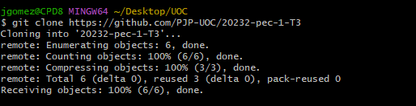
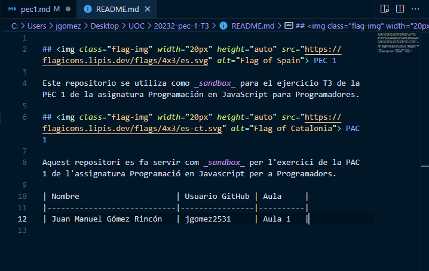
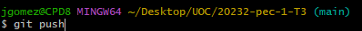

# Respuestas a las preguntas teóricas / Respostes a les preguntes teòriques

## Ejercicio T1 / Exercici T1
### T1.1 (1p) Indica los comandos que debería realizar cada desarrollador para sincronizar sus cambios con el repositorio en GitHub.
- Dev 1: 
    git add style.css
    git commit -m "Cambios en style.css"
    git push origin main
    git pull

- Dev 2: 
    git add index.html
    git commit -m "Cambios en index.html"
    git push origin main
    git pull

- Dev 3: 
    git add app.js
    git commit -m "Cambios en app.js"
    git push origin main
    git pull

### T1.2 (1p) ¿Puede darse alguna situación de conflicto en este escenario? Si es así, descríbela.
Aparentemente no veo ninguna situción de conflicto en el escenario actual, ya que cada desarrollador está modificando archivos diferentes. En el caso de que dos desarrolladores estuviesen trabajando con el mismo fichero si que podría haber problemas de que se machacasen datos de uno de los dos al hacer los commits.

## Ejercicio T2 / Exercici T2
### T2.1 (1p) ¿Qué commits están considerados en la rama developer-2?
Está considerado el commit C9, que se ha subido a la rama main.

### T2.2 (2p) Teniendo en cuenta que la rama developer-2 fue integrada en la rama main porque corregía un problema detectado en la aplicación, ¿qué debe hacer el desarrollador que continua trabajando en rama developer-1?

Debería realizar un git pull para actualizar su rama de trabajo con la rama principal y así evitar subir a la main otra vez el fallo sin corregir de la aplicación.

## Ejercicio T3 / Exercici T3
### T3.1 (2p) Envia un pull request tal y como se indica en el enunciado. En tu respuesta deberás describir los pasos que has hecho, adjuntando capturas de pantalla que muestren el proceso y, finalmente, el enlace al pull request que has creado.

Pasos realizados para hacer el pull request:

1. Realizar un git clone del repositorio [`https://github.com/PJP-UOC/20232-pec-1-T3`](https://github.com/PJP-UOC/20232-pec-1-T3)

2. Editar el fichero README.md y agregando al final una línea con mi información.

3. Realizo un git add del fichero README, un git commit de los cambios efectuados y por último un git push.

